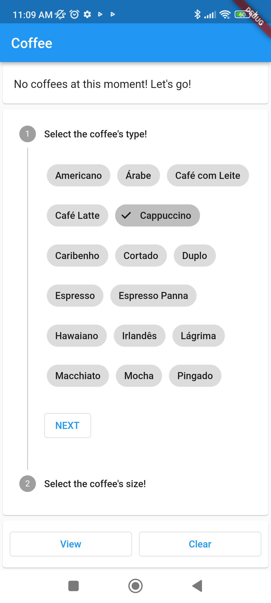
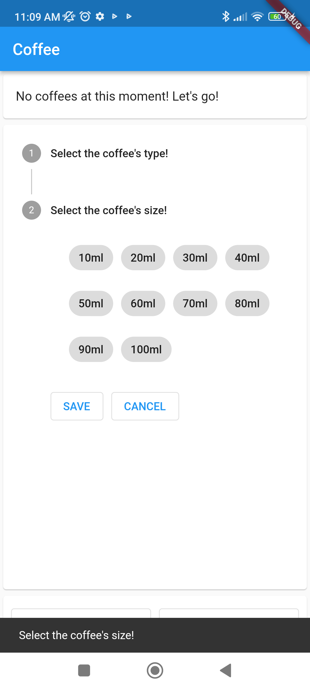
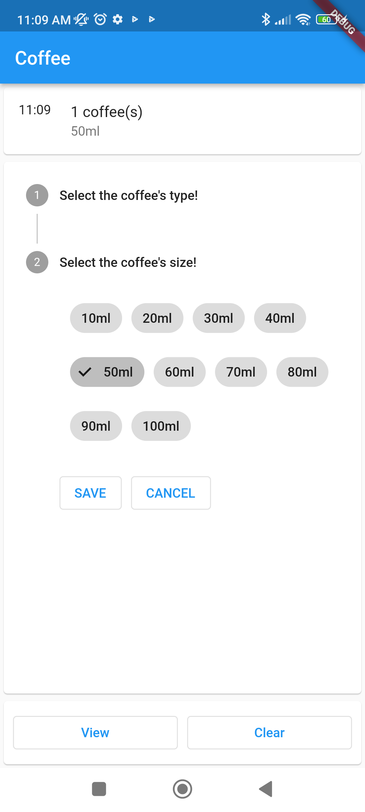
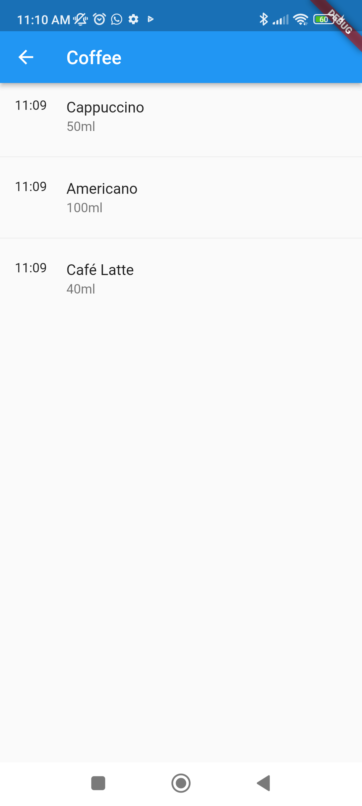

# Coffee Control

A simple application for you can control your daily consumption of coffee. 

This project was built for show a practical case of provider package and state management. 

If a UI/UX professional wants to help me we can build a new version and publish it in stores. 

# Screenshots

